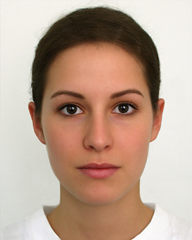
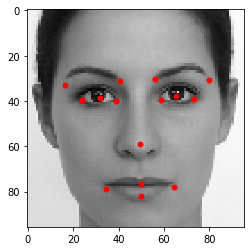
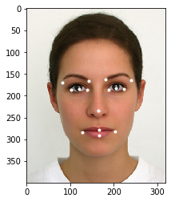

# Facial Keypoint Detection

This is basic small project to recognize human facial key-points using machine learning model called convolutional neural networks. This is generally used for face detection and analysis.

## Input image  
Actual image

## Output 

Greyscale image

Facial key-points detected image

